# Conversation Architecture

## Overview

SynapseFlow uses a **LangGraph-based conversation engine** that combines:
- **Symbolic AI** (rule-based reasoning, knowledge graph traversal)
- **Neural AI** (LLM inference, semantic understanding)
- **Multi-layer memory** (Redis, Mem0, Neo4j, Graphiti)

This document describes the architecture, data flow, and integration of all components.

---

## High-Level Architecture

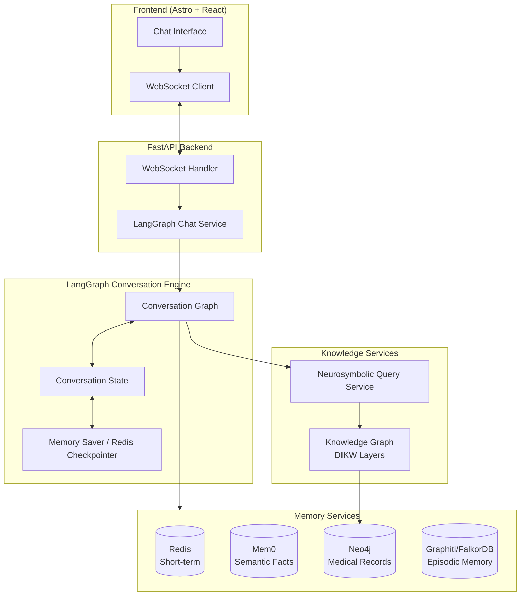
```mermaid
flowchart TB
    subgraph Frontend["Frontend (Astro + React)"]
        UI[Chat Interface]
        WS[WebSocket Client]
    end

    subgraph API["FastAPI Backend"]
        WSHandler[WebSocket Handler]
        ChatService[LangGraph Chat Service]
    end

    subgraph LangGraph["LangGraph Conversation Engine"]
        Graph[Conversation Graph]
        State[Conversation State]
        Checkpointer[Memory Saver / Redis Checkpointer]
    end

    subgraph Memory["Memory Services"]
        Redis[(Redis<br/>Short-term)]
        Mem0[(Mem0<br/>Semantic Facts)]
        Neo4j[(Neo4j<br/>Medical Records)]
        Graphiti[(Graphiti/FalkorDB<br/>Episodic Memory)]
    end

    subgraph Knowledge["Knowledge Services"]
        Neuro[Neurosymbolic Query Service]
        KG[Knowledge Graph<br/>DIKW Layers]
    end

    UI --> WS
    WS <--> WSHandler
    WSHandler --> ChatService
    ChatService --> Graph
    Graph <--> State
    State <--> Checkpointer

    Graph --> Memory
    Graph --> Neuro
    Neuro --> KG
    KG --> Neo4j
```

---

## Thread ID and State Persistence

### Deterministic Thread IDs

Thread IDs are now **deterministic** and based solely on `patient_id` and `session_id`:

```text
thread:{patient_id}:{session_id}
```

This ensures:
- **Consistency**: Same patient+session always maps to the same thread
- **Persistence**: Thread IDs survive server restarts
- **Reliability**: No random UUID suffixes that could break continuity

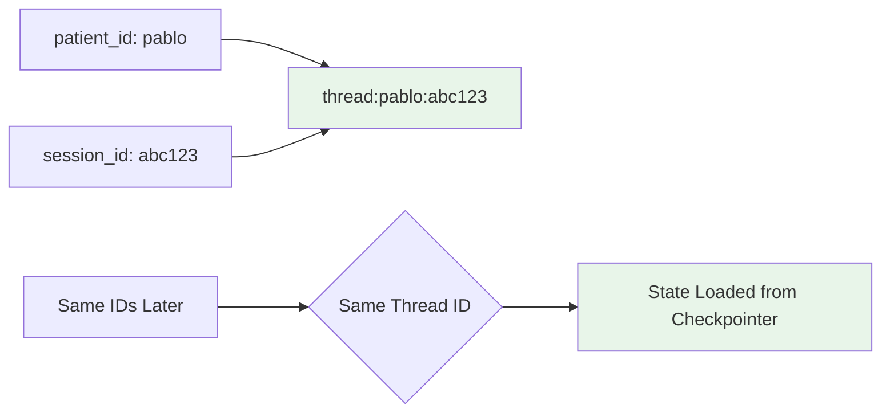
```mermaid
flowchart LR
    A[patient_id: pablo] --> C[thread:pablo:abc123]
    B[session_id: abc123] --> C

    D[Same IDs Later] --> E{Same Thread ID}
    E --> F[State Loaded from Checkpointer]

    style C fill:#e8f5e9
    style F fill:#e8f5e9
```

### State Loading Logic

The system uses a **robust state check** to determine if a conversation exists:

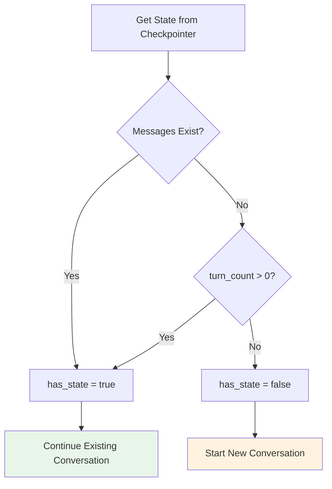
```mermaid
flowchart TD
    A[Get State from Checkpointer] --> B{Messages Exist?}
    B --> |Yes| C[has_state = true]
    B --> |No| D{turn_count > 0?}
    D --> |Yes| C
    D --> |No| E[has_state = false]
    C --> F[Continue Existing Conversation]
    E --> G[Start New Conversation]

    style F fill:#e8f5e9
    style G fill:#fff3e0
```

---

## Conversation Graph Flow

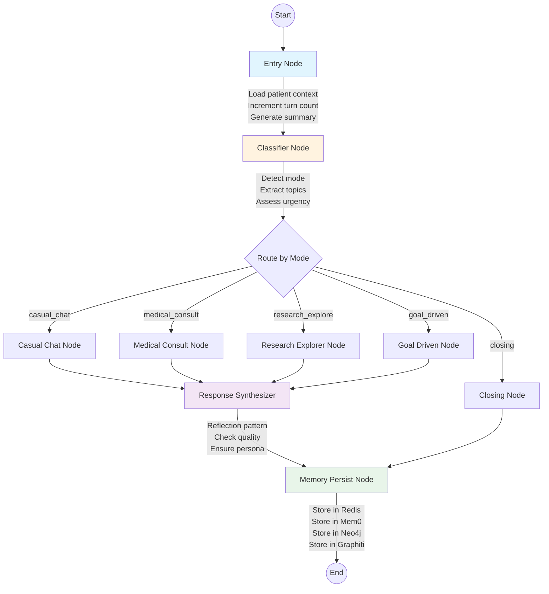
```mermaid
flowchart TD
    START((Start)) --> Entry[Entry Node]

    Entry --> |"Load patient context<br/>Increment turn count<br/>Generate summary"| Classifier[Classifier Node]

    Classifier --> |"Detect mode<br/>Extract topics<br/>Assess urgency"| Router{Route by Mode}

    Router --> |casual_chat| Casual[Casual Chat Node]
    Router --> |medical_consult| Medical[Medical Consult Node]
    Router --> |research_explore| Research[Research Explorer Node]
    Router --> |goal_driven| Goal[Goal Driven Node]
    Router --> |closing| Closing[Closing Node]

    Casual --> Synth[Response Synthesizer]
    Medical --> Synth
    Research --> Synth
    Goal --> Synth

    Synth --> |"Reflection pattern<br/>Check quality<br/>Ensure persona"| Persist[Memory Persist Node]
    Closing --> Persist

    Persist --> |"Store in Redis<br/>Store in Mem0<br/>Store in Neo4j<br/>Store in Graphiti"| END((End))

    style Entry fill:#e1f5fe
    style Classifier fill:#fff3e0
    style Synth fill:#f3e5f5
    style Persist fill:#e8f5e9
```

---

## Conversation State Schema

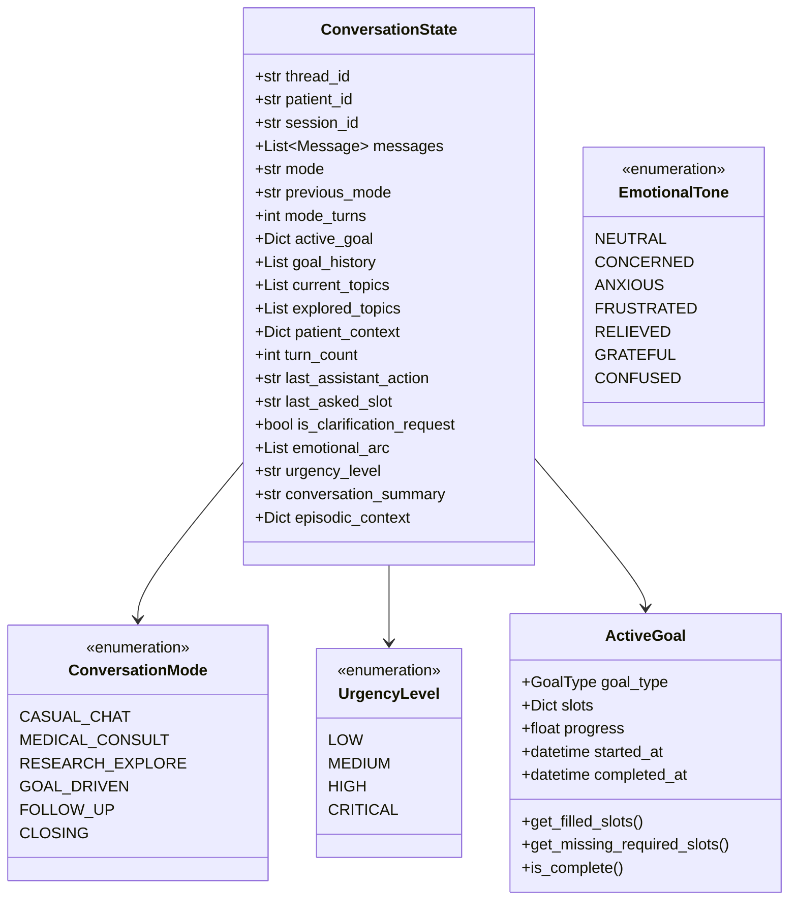
```mermaid
classDiagram
    class ConversationState {
        +str thread_id
        +str patient_id
        +str session_id
        +List~Message~ messages
        +str mode
        +str previous_mode
        +int mode_turns
        +Dict active_goal
        +List goal_history
        +List current_topics
        +List explored_topics
        +Dict patient_context
        +int turn_count
        +str last_assistant_action
        +str last_asked_slot
        +bool is_clarification_request
        +List emotional_arc
        +str urgency_level
        +str conversation_summary
        +Dict episodic_context
    }

    class ConversationMode {
        <<enumeration>>
        CASUAL_CHAT
        MEDICAL_CONSULT
        RESEARCH_EXPLORE
        GOAL_DRIVEN
        FOLLOW_UP
        CLOSING
    }

    class UrgencyLevel {
        <<enumeration>>
        LOW
        MEDIUM
        HIGH
        CRITICAL
    }

    class EmotionalTone {
        <<enumeration>>
        NEUTRAL
        CONCERNED
        ANXIOUS
        FRUSTRATED
        RELIEVED
        GRATEFUL
        CONFUSED
    }

    class ActiveGoal {
        +GoalType goal_type
        +Dict slots
        +float progress
        +datetime started_at
        +datetime completed_at
        +get_filled_slots()
        +get_missing_required_slots()
        +is_complete()
    }

    ConversationState --> ConversationMode
    ConversationState --> UrgencyLevel
    ConversationState --> ActiveGoal
```

---

## Memory Architecture (3+1 Layers)

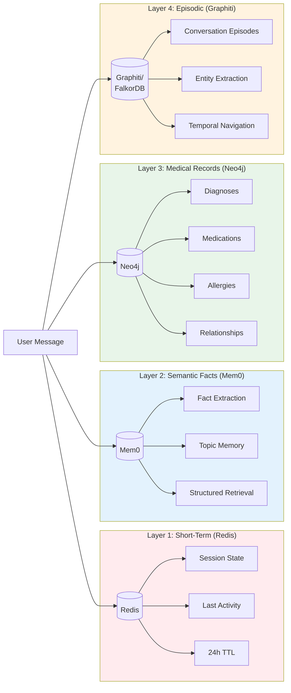
```mermaid
flowchart LR
    subgraph ShortTerm["Layer 1: Short-Term (Redis)"]
        Redis[(Redis)]
        R1[Session State]
        R2[Last Activity]
        R3[24h TTL]
    end

    subgraph MidTerm["Layer 2: Semantic Facts (Mem0)"]
        Mem0[(Mem0)]
        M1[Fact Extraction]
        M2[Topic Memory]
        M3[Structured Retrieval]
    end

    subgraph LongTerm["Layer 3: Medical Records (Neo4j)"]
        Neo4j[(Neo4j)]
        N1[Diagnoses]
        N2[Medications]
        N3[Allergies]
        N4[Relationships]
    end

    subgraph Episodic["Layer 4: Episodic (Graphiti)"]
        Graphiti[(Graphiti/<br/>FalkorDB)]
        G1[Conversation Episodes]
        G2[Entity Extraction]
        G3[Temporal Navigation]
    end

    Message[User Message] --> Redis
    Message --> Mem0
    Message --> Neo4j
    Message --> Graphiti

    Redis --> R1
    Redis --> R2
    Redis --> R3

    Mem0 --> M1
    Mem0 --> M2
    Mem0 --> M3

    Neo4j --> N1
    Neo4j --> N2
    Neo4j --> N3
    Neo4j --> N4

    Graphiti --> G1
    Graphiti --> G2
    Graphiti --> G3

    style ShortTerm fill:#ffebee
    style MidTerm fill:#e3f2fd
    style LongTerm fill:#e8f5e9
    style Episodic fill:#fff3e0
```

---

## Patient Memory Service Flow

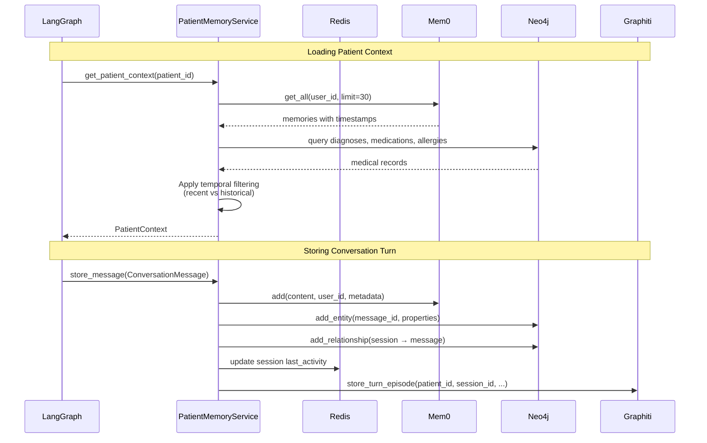
```mermaid
sequenceDiagram
    participant Graph as LangGraph
    participant PMS as PatientMemoryService
    participant Redis
    participant Mem0
    participant Neo4j
    participant Graphiti

    Note over Graph,Graphiti: Loading Patient Context
    Graph->>PMS: get_patient_context(patient_id)
    PMS->>Mem0: get_all(user_id, limit=30)
    Mem0-->>PMS: memories with timestamps
    PMS->>Neo4j: query diagnoses, medications, allergies
    Neo4j-->>PMS: medical records
    PMS->>PMS: Apply temporal filtering<br/>(recent vs historical)
    PMS-->>Graph: PatientContext

    Note over Graph,Graphiti: Storing Conversation Turn
    Graph->>PMS: store_message(ConversationMessage)
    PMS->>Mem0: add(content, user_id, metadata)
    PMS->>Neo4j: add_entity(message_id, properties)
    PMS->>Neo4j: add_relationship(session → message)
    PMS->>Redis: update session last_activity
    PMS->>Graphiti: store_turn_episode(patient_id, session_id, ...)
```

---

## Neurosymbolic Query Service

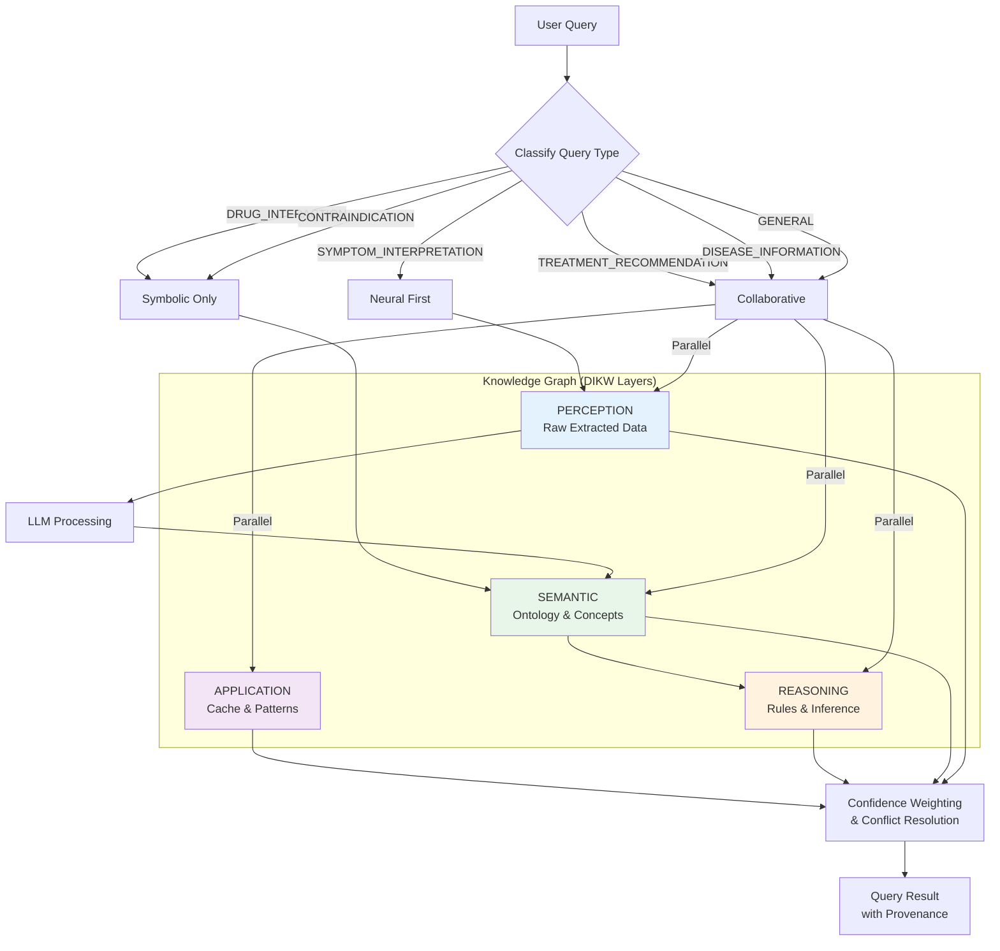
```mermaid
flowchart TB
    Query[User Query] --> Classify{Classify Query Type}

    Classify --> |DRUG_INTERACTION| Symbolic[Symbolic Only]
    Classify --> |CONTRAINDICATION| Symbolic
    Classify --> |SYMPTOM_INTERPRETATION| Neural[Neural First]
    Classify --> |TREATMENT_RECOMMENDATION| Collab[Collaborative]
    Classify --> |DISEASE_INFORMATION| Collab
    Classify --> |GENERAL| Collab

    subgraph DIKW["Knowledge Graph (DIKW Layers)"]
        App[APPLICATION<br/>Cache & Patterns]
        Reason[REASONING<br/>Rules & Inference]
        Semantic[SEMANTIC<br/>Ontology & Concepts]
        Percept[PERCEPTION<br/>Raw Extracted Data]
    end

    Symbolic --> Semantic
    Semantic --> Reason

    Neural --> Percept
    Percept --> LLM[LLM Processing]
    LLM --> Semantic

    Collab --> |Parallel| App
    Collab --> |Parallel| Reason
    Collab --> |Parallel| Semantic
    Collab --> |Parallel| Percept

    App --> Merge[Confidence Weighting<br/>& Conflict Resolution]
    Reason --> Merge
    Semantic --> Merge
    Percept --> Merge

    Merge --> Result[Query Result<br/>with Provenance]

    style App fill:#f3e5f5
    style Reason fill:#fff3e0
    style Semantic fill:#e8f5e9
    style Percept fill:#e3f2fd
```

---

## Conversation Node Details

### Entry Node

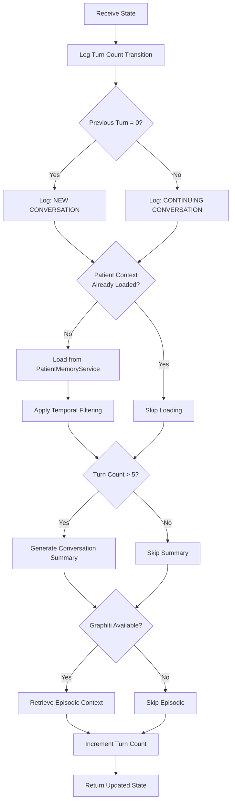
```mermaid
flowchart TD
    A[Receive State] --> B[Log Turn Count Transition]
    B --> C{Previous Turn = 0?}
    C --> |Yes| D[Log: NEW CONVERSATION]
    C --> |No| E[Log: CONTINUING CONVERSATION]
    D --> F{Patient Context<br/>Already Loaded?}
    E --> F
    F --> |No| G[Load from PatientMemoryService]
    F --> |Yes| H[Skip Loading]
    G --> I[Apply Temporal Filtering]
    I --> J{Turn Count > 5?}
    H --> J
    J --> |Yes| K[Generate Conversation Summary]
    J --> |No| L[Skip Summary]
    K --> M{Graphiti Available?}
    L --> M
    M --> |Yes| N[Retrieve Episodic Context]
    M --> |No| O[Skip Episodic]
    N --> P[Increment Turn Count]
    O --> P
    P --> Q[Return Updated State]
```

### Classifier Node
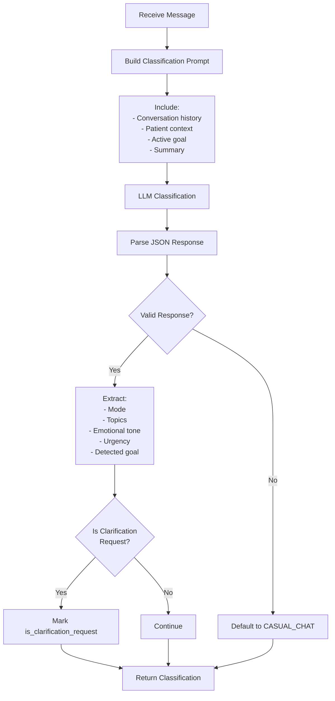
```mermaid
flowchart TD
    A[Receive Message] --> B[Build Classification Prompt]
    B --> C[Include:<br/>- Conversation history<br/>- Patient context<br/>- Active goal<br/>- Summary]
    C --> D[LLM Classification]
    D --> E[Parse JSON Response]
    E --> F{Valid Response?}
    F --> |Yes| G[Extract:<br/>- Mode<br/>- Topics<br/>- Emotional tone<br/>- Urgency<br/>- Detected goal]
    F --> |No| H[Default to CASUAL_CHAT]
    G --> I{Is Clarification<br/>Request?}
    I --> |Yes| J[Mark is_clarification_request]
    I --> |No| K[Continue]
    J --> L[Return Classification]
    K --> L
    H --> L
```

### Casual Chat Node (with Greeting Variety)

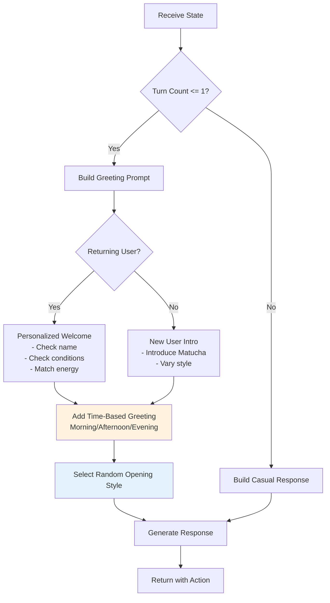
```mermaid
flowchart TD
    A[Receive State] --> B{Turn Count <= 1?}
    B --> |Yes| C[Build Greeting Prompt]
    B --> |No| D[Build Casual Response]

    C --> E{Returning User?}
    E --> |Yes| F[Personalized Welcome<br/>- Check name<br/>- Check conditions<br/>- Match energy]
    E --> |No| G[New User Intro<br/>- Introduce Matucha<br/>- Vary style]

    F --> H[Add Time-Based Greeting<br/>Morning/Afternoon/Evening]
    G --> H
    H --> I[Select Random Opening Style]
    I --> J[Generate Response]
    D --> J
    J --> K[Return with Action]

    style H fill:#fff3e0
    style I fill:#e3f2fd
```

### Goal Driven Node
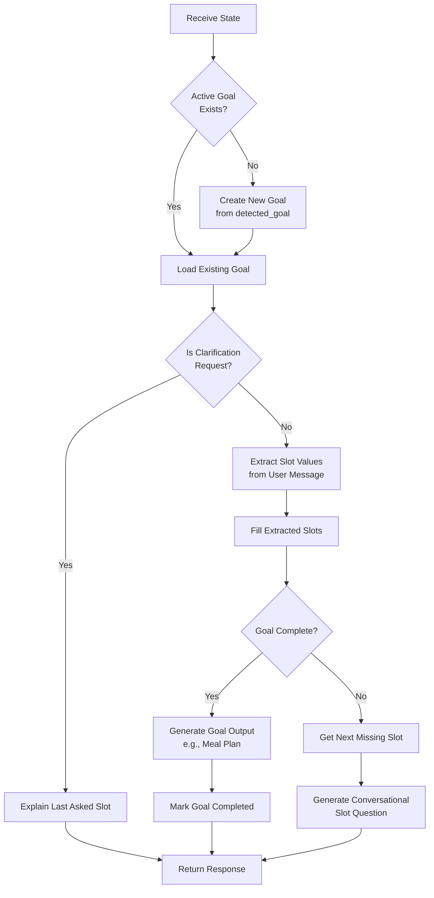
```mermaid
flowchart TD
    A[Receive State] --> B{Active Goal<br/>Exists?}
    B --> |No| C[Create New Goal<br/>from detected_goal]
    B --> |Yes| D[Load Existing Goal]
    C --> D
    D --> E{Is Clarification<br/>Request?}
    E --> |Yes| F[Explain Last Asked Slot]
    E --> |No| G[Extract Slot Values<br/>from User Message]
    F --> Z[Return Response]
    G --> H[Fill Extracted Slots]
    H --> I{Goal Complete?}
    I --> |Yes| J[Generate Goal Output<br/>e.g., Meal Plan]
    I --> |No| K[Get Next Missing Slot]
    J --> L[Mark Goal Completed]
    K --> M[Generate Conversational<br/>Slot Question]
    L --> Z
    M --> Z
```

---

## Goal Types and Slots

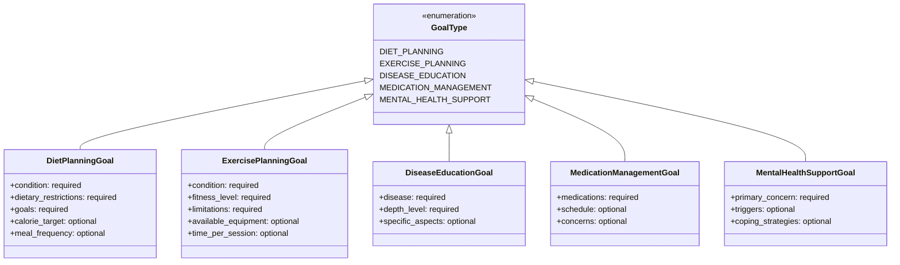
```mermaid
classDiagram
    class GoalType {
        <<enumeration>>
        DIET_PLANNING
        EXERCISE_PLANNING
        DISEASE_EDUCATION
        MEDICATION_MANAGEMENT
        MENTAL_HEALTH_SUPPORT
    }

    class DietPlanningGoal {
        +condition: required
        +dietary_restrictions: required
        +goals: required
        +calorie_target: optional
        +meal_frequency: optional
    }

    class ExercisePlanningGoal {
        +condition: required
        +fitness_level: required
        +limitations: required
        +available_equipment: optional
        +time_per_session: optional
    }

    class DiseaseEducationGoal {
        +disease: required
        +depth_level: required
        +specific_aspects: optional
    }

    class MedicationManagementGoal {
        +medications: required
        +schedule: optional
        +concerns: optional
    }

    class MentalHealthSupportGoal {
        +primary_concern: required
        +triggers: optional
        +coping_strategies: optional
    }

    GoalType <|-- DietPlanningGoal
    GoalType <|-- ExercisePlanningGoal
    GoalType <|-- DiseaseEducationGoal
    GoalType <|-- MedicationManagementGoal
    GoalType <|-- MentalHealthSupportGoal
```

---

## Response Synthesizer (Reflection Pattern)

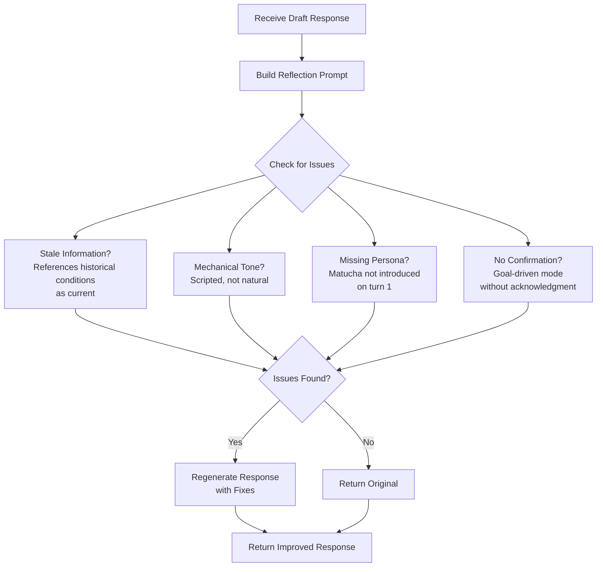
```mermaid
flowchart TD
    A[Receive Draft Response] --> B[Build Reflection Prompt]
    B --> C{Check for Issues}

    C --> D[Stale Information?<br/>References historical conditions<br/>as current]
    C --> E[Mechanical Tone?<br/>Scripted, not natural]
    C --> F[Missing Persona?<br/>Matucha not introduced<br/>on turn 1]
    C --> G[No Confirmation?<br/>Goal-driven mode<br/>without acknowledgment]

    D --> H{Issues Found?}
    E --> H
    F --> H
    G --> H

    H --> |Yes| I[Regenerate Response<br/>with Fixes]
    H --> |No| J[Return Original]

    I --> K[Return Improved Response]
    J --> K
```

---

## WebSocket Message Flow

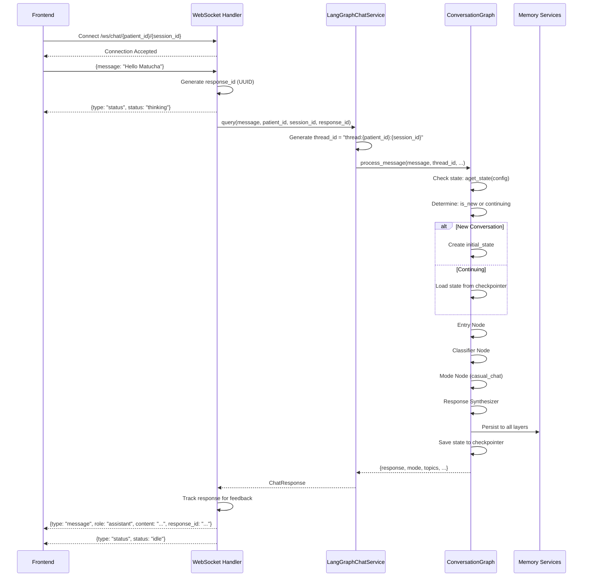
```mermaid
sequenceDiagram
    participant Client as Frontend
    participant WS as WebSocket Handler
    participant LG as LangGraphChatService
    participant Graph as ConversationGraph
    participant Memory as Memory Services

    Client->>WS: Connect /ws/chat/{patient_id}/{session_id}
    WS-->>Client: Connection Accepted

    Client->>WS: {message: "Hello Matucha"}
    WS->>WS: Generate response_id (UUID)
    WS-->>Client: {type: "status", status: "thinking"}

    WS->>LG: query(message, patient_id, session_id, response_id)
    LG->>LG: Generate thread_id = "thread:{patient_id}:{session_id}"
    LG->>Graph: process_message(message, thread_id, ...)

    Graph->>Graph: Check state: aget_state(config)
    Graph->>Graph: Determine: is_new or continuing

    alt New Conversation
        Graph->>Graph: Create initial_state
    else Continuing
        Graph->>Graph: Load state from checkpointer
    end

    Graph->>Graph: Entry Node
    Graph->>Graph: Classifier Node
    Graph->>Graph: Mode Node (casual_chat)
    Graph->>Graph: Response Synthesizer
    Graph->>Memory: Persist to all layers
    Graph->>Graph: Save state to checkpointer

    Graph-->>LG: {response, mode, topics, ...}
    LG-->>WS: ChatResponse

    WS->>WS: Track response for feedback
    WS-->>Client: {type: "message", role: "assistant", content: "...", response_id: "..."}
    WS-->>Client: {type: "status", status: "idle"}
```

---

## Temporal Awareness in Memory

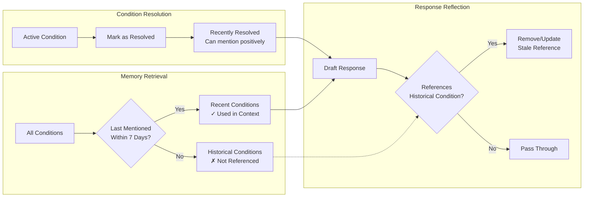
```mermaid
flowchart LR
    subgraph Retrieval["Memory Retrieval"]
        All[All Conditions] --> Filter{Last Mentioned<br/>Within 7 Days?}
        Filter --> |Yes| Recent[Recent Conditions<br/>✓ Used in Context]
        Filter --> |No| Historical[Historical Conditions<br/>✗ Not Referenced]
    end

    subgraph Reflection["Response Reflection"]
        Draft[Draft Response] --> Check{References<br/>Historical Condition?}
        Check --> |Yes| Fix[Remove/Update<br/>Stale Reference]
        Check --> |No| Pass[Pass Through]
    end

    subgraph Resolution["Condition Resolution"]
        Active[Active Condition] --> Resolve[Mark as Resolved]
        Resolve --> Resolved[Recently Resolved<br/>Can mention positively]
    end

    Recent --> Draft
    Historical -.-> Check
    Resolved --> Draft
```

---

## Service Dependencies

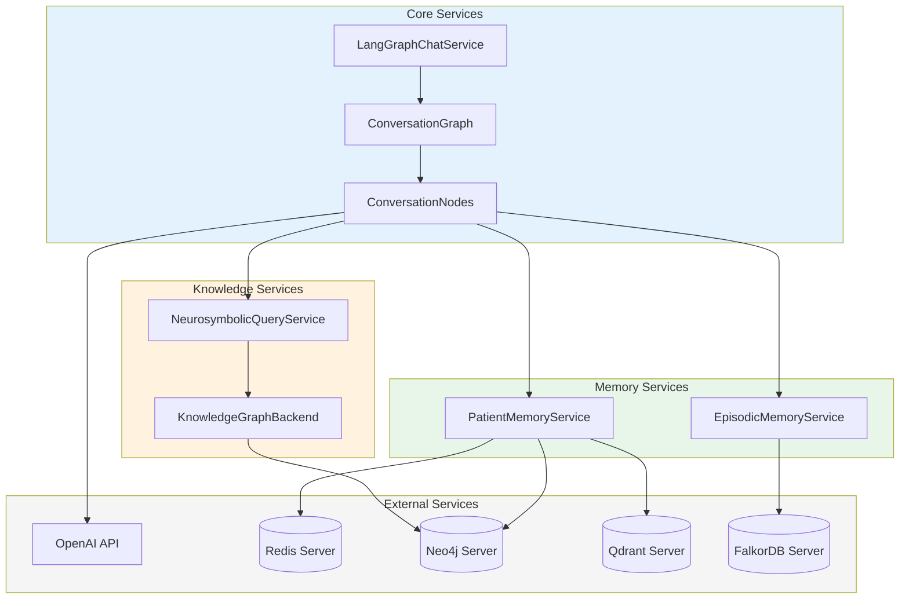
```mermaid
flowchart TB
    subgraph External["External Services"]
        OpenAI[OpenAI API]
        RedisExt[(Redis Server)]
        Neo4jExt[(Neo4j Server)]
        QdrantExt[(Qdrant Server)]
        FalkorExt[(FalkorDB Server)]
    end

    subgraph Core["Core Services"]
        LGService[LangGraphChatService]
        ConvGraph[ConversationGraph]
        ConvNodes[ConversationNodes]
    end

    subgraph Memory["Memory Services"]
        PMS[PatientMemoryService]
        EMS[EpisodicMemoryService]
    end

    subgraph Knowledge["Knowledge Services"]
        NQS[NeurosymbolicQueryService]
        KGB[KnowledgeGraphBackend]
    end

    LGService --> ConvGraph
    ConvGraph --> ConvNodes
    ConvNodes --> OpenAI
    ConvNodes --> PMS
    ConvNodes --> NQS
    ConvNodes --> EMS

    PMS --> RedisExt
    PMS --> Neo4jExt
    PMS --> QdrantExt

    EMS --> FalkorExt

    NQS --> KGB
    KGB --> Neo4jExt

    style External fill:#f5f5f5
    style Core fill:#e3f2fd
    style Memory fill:#e8f5e9
    style Knowledge fill:#fff3e0
```

---

## Configuration & Feature Flags

| Flag | Purpose | Default |
|------|---------|---------|
| `ENABLE_LANGGRAPH_CHAT` | Use LangGraph instead of IntelligentChatService | `false` |
| `ENABLE_GRAPHITI_MEMORY` | Enable Graphiti episodic memory | `false` |
| `ENABLE_CONVERSATIONAL` | Enable persona/intent classification | `true` |
| `ENABLE_AUTO_PROMOTION` | Auto-promote entities between DIKW layers | `true` |

---

## Key Files Reference

| File | Purpose |
|------|---------|
| `src/application/services/langgraph_chat_service.py` | Service adapter for LangGraph (deterministic thread IDs) |
| `src/application/services/conversation_graph.py` | Graph definition, state persistence, execution |
| `src/application/services/conversation_nodes.py` | Node implementations (with greeting variety) |
| `src/application/services/conversation_router.py` | Mode routing logic |
| `src/domain/conversation_state.py` | State schema and enums |
| `src/application/services/patient_memory_service.py` | 3-layer memory management |
| `src/application/services/episodic_memory_service.py` | Graphiti integration |
| `src/application/services/neurosymbolic_query_service.py` | Knowledge retrieval |

---

## Design Patterns Used

| Pattern | Location | Purpose |
|---------|----------|---------|
| **State Machine** | ConversationGraph | Mode-based conversation routing |
| **Reducer** | `add_messages` | Accumulate message history across turns |
| **Adapter** | LangGraphChatService | Interface compatibility with existing code |
| **Factory** | `build_conversation_graph()` | Dependency injection for nodes |
| **Reflection** | Response Synthesizer | Quality improvement via self-critique |
| **Strategy** | NeurosymbolicQueryService | Different execution paths by query type |
| **Repository** | PatientMemoryService | Abstract multi-layer storage |
| **Observer** | Memory Persist Node | Store to multiple backends |
| **Deterministic ID** | `_get_thread_id()` | Consistent thread identification |

---

## Persona: Matucha

- **Name**: Matucha
- **Tone**: Warm, professional, empathetic
- **Role**: Medical assistant for autoimmune disease patients
- **Greeting Variety**:
  - Time-based greetings (morning/afternoon/evening)
  - Randomized opening styles
  - Mirrors user's energy (casual → casual)
  - Uses patient name when known
- **Behavior**:
  - Introduces herself on first turn (varied styles)
  - Remembers returning patients
  - Shows genuine concern
  - Provides safety warnings when needed
  - Recommends professional consultation for serious issues

---

## Debug Logging

The system includes comprehensive debug logging for troubleshooting:

### Process Message Logging

```text
[PROCESS_MSG] thread_id=thread:pablo:abc123
[PROCESS_MSG] Loaded state: turn_count=5, messages=10
[PROCESS_MSG] is_new=False (has_state=True)
[PROCESS_MSG] CONTINUING conversation for thread (turn 5 -> 6)
```

### Entry Node Logging

```text
[ENTRY_NODE] thread_id=thread:pablo:abc123
[ENTRY_NODE] Turn 5 -> 6, Messages in state: 10
[ENTRY_NODE] *** CONTINUING CONVERSATION (turn_count was 5) ***
```

### Goal Tracking Logging

```text
[GOAL_DRIVEN] Turn started - user: 'I have Crohn's disease'
[GOAL_DRIVEN] active_goal exists: type=diet_planning, progress=0.33
[GOAL_DRIVEN] Slot 'condition': filled=True, value=Crohn's disease
```

---

## Recent Changes (v2.0)

### Thread ID Persistence Fix
- **Before**: Thread IDs had random UUID suffixes, breaking continuity on restart
- **After**: Deterministic `thread:{patient_id}:{session_id}` format

### Robust State Loading
- **Before**: Only checked `turn_count == 0`
- **After**: Checks both `messages.length > 0` OR `turn_count > 0`

### Greeting Variety
- **Before**: Same greeting pattern every time
- **After**: Time-based, randomized styles, energy matching

### Reset Conversation
- **Before**: No-op for MemorySaver
- **After**: Properly clears checkpointer storage for the thread
