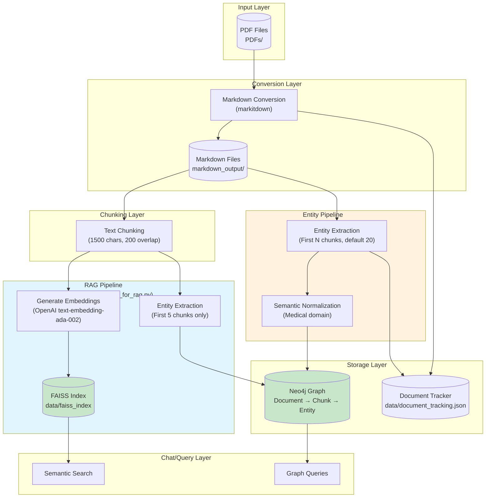
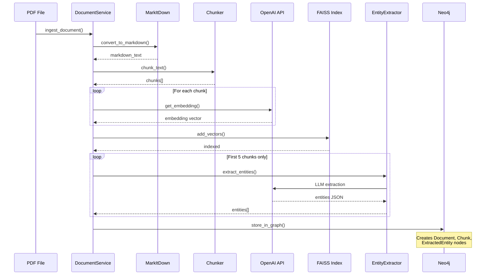
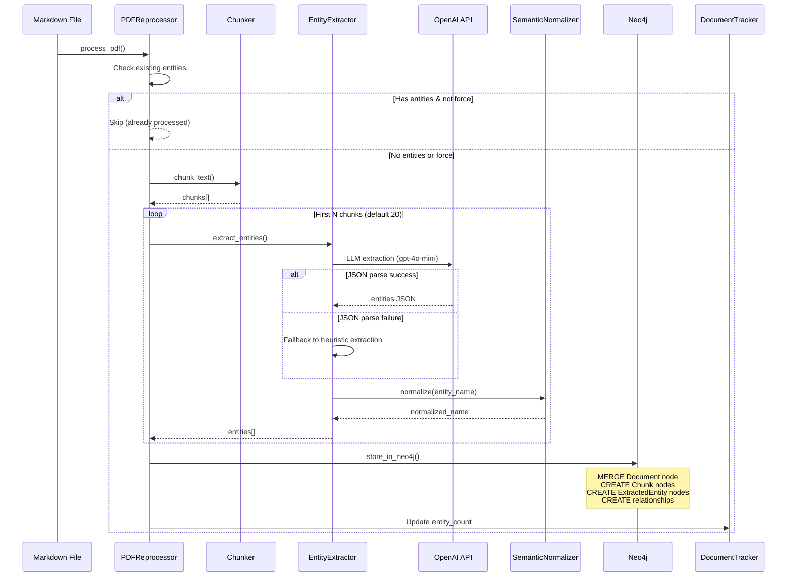
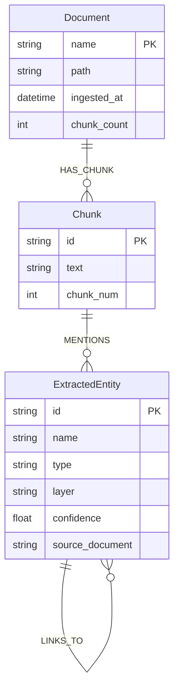

# Document Ingestion Pipeline

## Overview



## Detailed Flow

### 1. RAG Ingestion (`ingest_pdfs_for_rag.py`)



### 2. Entity Reprocessing (`reprocess_all_pdfs.py`)



## Neo4j Graph Schema



## Data Flow Summary

| Stage | RAG Pipeline | Entity Pipeline |
|-------|--------------|-----------------|
| **Input** | PDF files | Existing markdown files |
| **Conversion** | PDF → Markdown | (uses existing) |
| **Chunking** | All chunks | All chunks |
| **Embeddings** | ALL chunks → FAISS | None |
| **Entity Extraction** | First 5 chunks | First N chunks (configurable) |
| **Storage** | FAISS + Neo4j | Neo4j only |
| **Use Case** | Semantic search in chat | Document detail view, graph visualization |

## Current State

```
FAISS Index:     18 vectors (limited RAG coverage)
Neo4j Entities:  Varies per document (20 chunks processed)
Documents:       42 PDFs tracked
```

## Commands

```bash
# Full RAG ingestion (embeddings + entities)
uv run python ingest_pdfs_for_rag.py

# Entity-only reprocessing (no embeddings)
uv run python scripts/reprocess_all_pdfs.py

# Reprocess with more chunks
uv run python scripts/reprocess_all_pdfs.py --max-chunks 50

# Skip already processed documents
uv run python scripts/reprocess_all_pdfs.py --skip-existing
```
